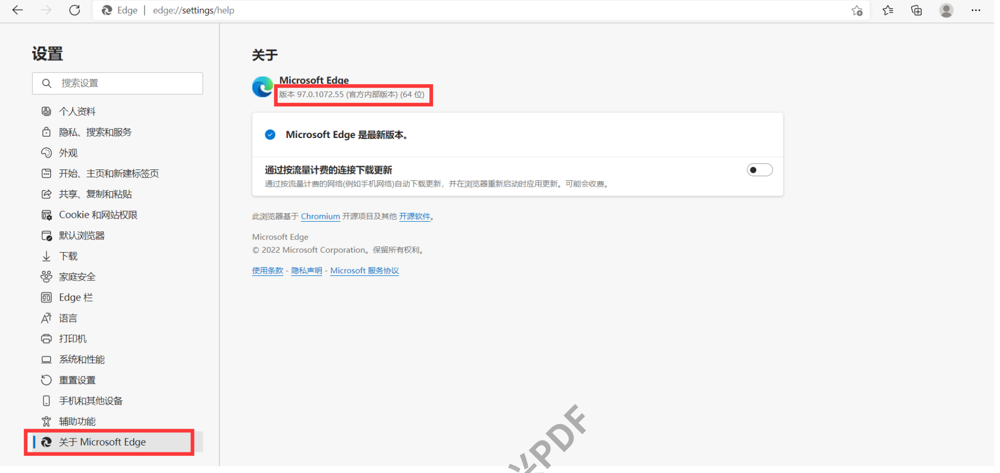
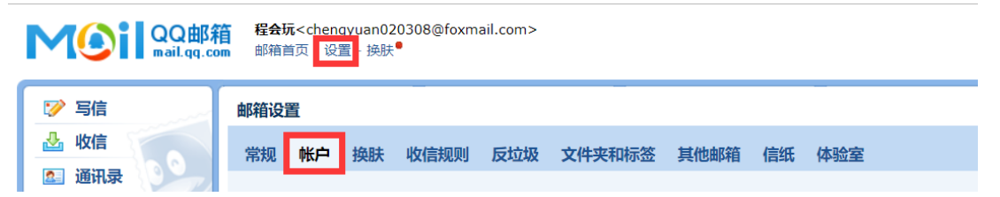
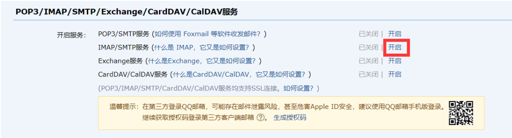
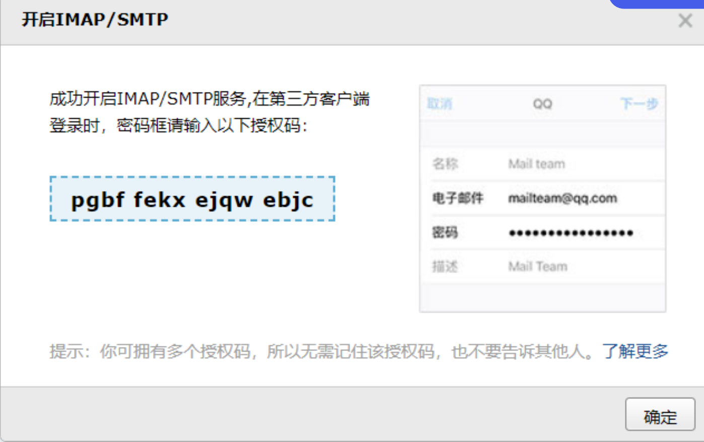
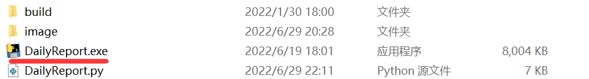

# HITDailyReport 1.0
**哈工大硕博版每日上报+出校申请**  
## 大傻瓜教程（仅每日上报和申请出校）
- 打开dateRecorder.txt
- 其中第一行可以不改动，这里一般是由程序自动填写的它最后一次成功的每日上报的日期，如果该日期为今天程序会提示今日已上报并退出 ，如果需要重新上报可以改成昨天的日期
- 第二行改为学号
- 第三行改为密码
- 默认自动申请出校，若想取消在第9行前加“不”
- 直接运行exe文件
- 本脚本仅支持edge标准版，如果运行失败查看配置说明第2条
- 运行期间需要保持edge显示在顶层
## 小傻瓜教程（截图发邮箱功能）
- 首先完成大傻瓜教程
- 看配置说明第3条
- 修改dateRecorder.txt
- 第四行改为发送者邮箱
- 第五行改为接收者邮箱一般都用一个就可以
- 第六行改为授权码
- 默认不发送邮件，发送邮件第十行”不“删掉
- 运行exe文件

## Version: 1.0
通过edge浏览器自动上报，可选择出校申请功能，并且可选择将上报成功截图发送给自己的qq邮箱   

# 配置说明
## 1.下载第三方库
	pip install selenium==4.0.0
这里需要注意的是，selenium的版本过高会影响程序运行
## 2.下载edge驱动文件:
注意查看edge版本（如果你使用的是edge beta或者dev，请仍然使用原版edge），下载对应版本的驱动器：

https://developer.microsoft.com/en-us/microsoft-edge/tools/webdriver/
这里选择edgediver x64版本

下载之后解压在任何位置皆可，记住解压之后的路径，后面要用

## 3.开启qq邮箱设置：

如果不想要发送邮件（发邮件主要为了告诉你已经成功每日上报，往往是把改任务设成了定时任务的时使用），可以跳过这一步



然后下拉

（如果这里默认是已开启，就关了重开一次）


按照要求发送短信，记住（复制一下）这个授权码



## 4.文件配置：
### 修改DaliyReport.py

stu_name是提交成功截图命名的一部分，可随意更改。

driver_url是下载的驱动器的路径，和py,exe,放到同一目录下就不需要修改路径


## 5. 每日自动上报、申请
### 1.打包
如果你的电脑对.py文件的默认打开方式是运行，那么可以不需要打包（一般都是打包比较好）

如果不是，可以使用pyinstaller工具

```
pip install pyinstaller
pyinstaller -F ./DailyReport.py
```
默认生成在从dist文件夹中，拖出来到和DailyReport.py同一个文件夹即可


### 2.自动运行
#### 这里可以设置开机自启动
将DailyReport.exe生成快捷方式

放入开机自启动的文件夹中即可

一般的路径为：C:\Users\【用户名】\AppData\Roaming\Microsoft\Windows\Start Menu\Programs\Startup
#### 也可以定一个计划任务让它每天定时启动
具体可以百度“win10怎么设置定时任务”

# 关于疫苗记录

每日上报中疫苗记录，这里没有写自动填写功能。

第一次需要大家手动每日上报的时候填写一下，后面应当会保持不变。

# 重点说明
本项目基本照搬，仅有少量修改，源地址
https://github.com/ChengHuiWan-cy/HITDailyReport.git